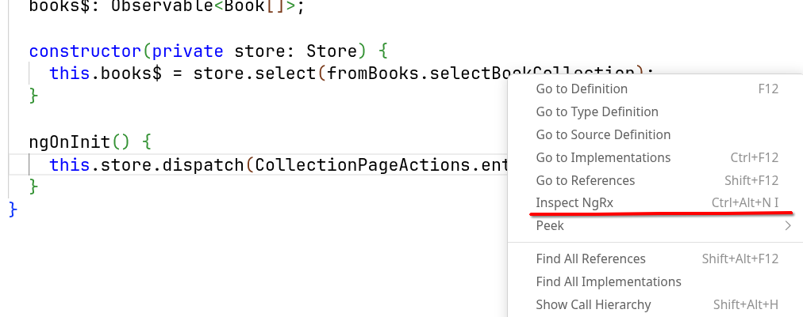
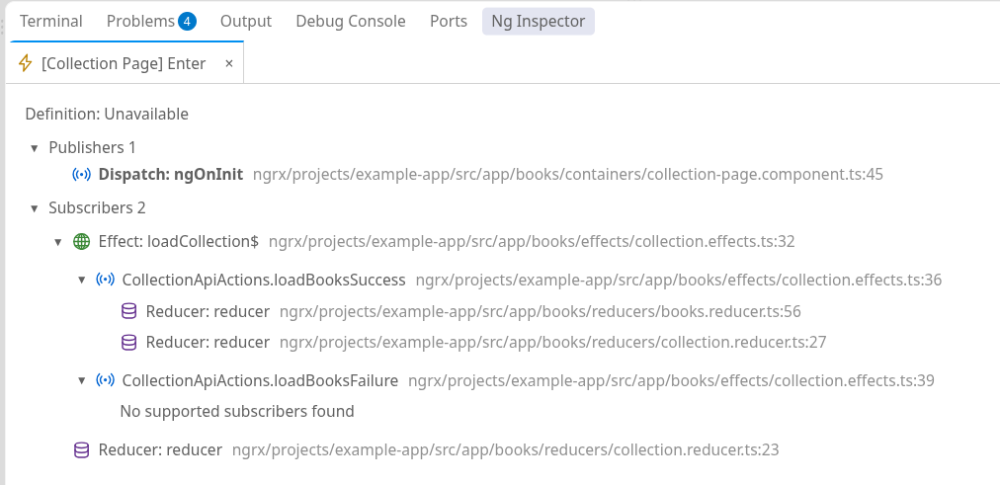
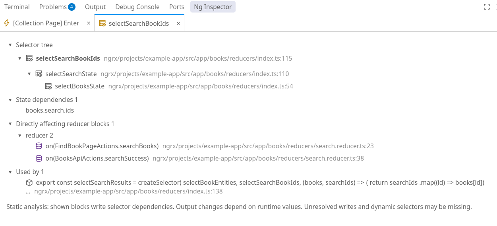
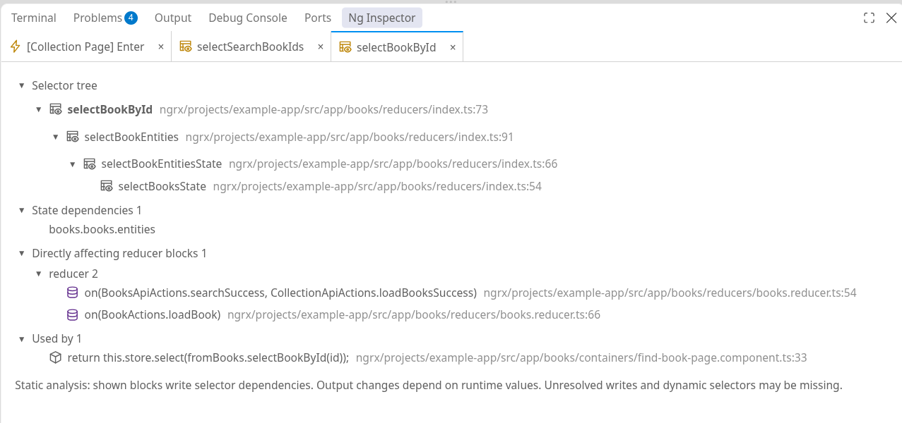
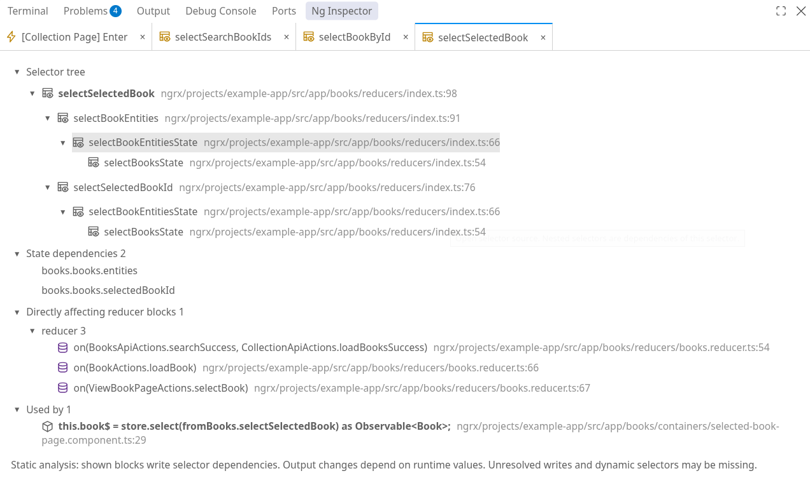

# NgRx Inspector

NgRx Inspector traces relationships between NgRx actions, effects, reducers, and selectors directly in VS Code. Related source locations appear in one panel, with separate tabs for each inspected action or selector.

## Exploring the store

- **Action inspection** - Action dispatch sites and the effects and reducers that handle each action.
- **Effect output navigation** - Recognized output actions and their subscribers.
- **Selector trees** - Selector inputs, including shared dependencies across branches.
- **State dependencies** - State paths used by a selector and supported reducer blocks that write those paths.
- **Source navigation** - Links from results to the corresponding files and source ranges.
- **Inspection tabs** - Multiple inspections with expansion and scroll position preserved while switching tabs.

Analysis runs locally without executing application code or sending source code to a service. NgRx Inspector is an independent extension, not an official NgRx release.

## Getting started

A trusted workspace, VS Code 1.96 or later, and the built-in **TypeScript and JavaScript Language Features** extension are required. Action navigation relies on TypeScript reference resolution in the workspace.

With the cursor on an action or selector in a TypeScript or TSX file, **Inspect NgRx** is available from the editor context menu, the Command Palette, or the keyboard shortcut below. Results open in the **NgRx Inspector** bottom panel. Unsupported symbols show a notification.

| Command          | Windows / Linux        | macOS                         |
| ---------------- | ---------------------- | ----------------------------- |
| **Inspect NgRx** | `Ctrl+Alt+N`, then `I` | `Control+Command+N`, then `I` |

The shortcut is a chord: the first combination is released before the final letter. It applies while a TypeScript or TSX editor has focus and can be customized through **Keyboard Shortcuts**.

## Inspecting actions

For a dispatch such as the following, inspecting `CollectionPageActions.enter` shows where the action is published and handled:

```ts
this.store.dispatch(CollectionPageActions.enter());
```



The action inspection shows the dispatch site, subscribers, and recognized actions emitted by effects:



The panel shows:

- **Definition** - The action definition when it can be resolved. This example shows **Unavailable** for the action created with `createActionGroup`.
- **Publishers** - Dispatch sites, such as `ngOnInit` in the collection page.
- **Subscribers** - Effects and reducers that handle the action.
- **Effect outputs** - Recognized actions emitted by an effect, with expandable subscriber branches. Here, `loadBooksSuccess` leads to two reducers, while `loadBooksFailure` has no supported subscribers.

A click on a source row opens and highlights its code. Effect branches expose recognized output actions and their subscribers; a double-click on an output action opens its own inspection tab.

Action types come from TypeScript hover information. An unresolved or widened type displays **Unavailable**.

## Inspecting selectors

The panel shows:

- **Selector tree** - The inspected selector and its inputs, including shared dependencies across branches.
- **State dependencies** - Resolved state paths read by the selector, such as `books.search.ids`.
- **Directly affecting reducer blocks** - Supported reducer blocks that write those state paths. These writes do not guarantee a change in the selector's output.
- **Used by** - Source locations that reference the selector, such as other selectors or `store.select` calls.

### Tracing selector inputs

`selectSearchBookIds` reads search IDs through `selectSearchState`:

```ts
export const selectSearchBookIds = createSelector(selectSearchState, fromSearch.getIds);
```



The tree traces the selector back to `selectBooksState`. The state dependency is `books.search.ids`, with two reducer blocks shown as writing that path.

### Inspecting selector factories

`selectBookById` takes an ID and returns a selector for the corresponding book:

```ts
export const selectBookById = (id: string) =>
  createSelector(selectBookEntities, (entities) => entities[id]);
```



The inspection follows the returned selector through `selectBookEntities` and identifies `books.books.entities` as its state dependency.

### Tracing shared dependencies

`selectSelectedBook` combines book entities with the selected book ID:

```ts
export const selectSelectedBook = createSelector(
  selectBookEntities,
  selectSelectedBookId,
  (entities, selectedId) => {
    return selectedId && entities[selectedId];
  },
);
```



Both input branches pass through `selectBookEntitiesState`. The inspection lists two state dependencies, `books.books.entities` and `books.books.selectedBookId`, and three reducer blocks that write those paths.

## Managing inspection tabs

Each distinct action or selector opens a closable tab. Inspecting the same item again refreshes its existing tab. Results are snapshots; rerunning the command refreshes them after source edits. Tabs remain available for the current extension session.

## Understanding analysis limits

Results show static source relationships, not runtime behavior or guaranteed selector output changes. Dynamic code, custom abstractions, and unsupported NgRx patterns may produce incomplete results. Signal Store event APIs are not supported.

If action results are missing while TypeScript loads, **Find All References** can help check language service readiness.

## Developing and testing

Build instructions and test commands are available in the [development guide](https://github.com/fredyang/ngrx-navigator/blob/main/developer.md).

## Licensing

NgRx Inspector is available under the [MIT license](https://github.com/fredyang/ngrx-navigator/blob/main/LICENSE). Copied example-app test fixtures retain their upstream license.
